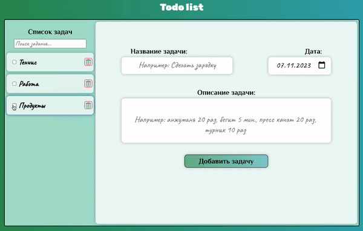
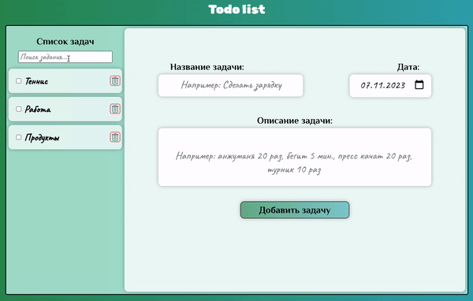
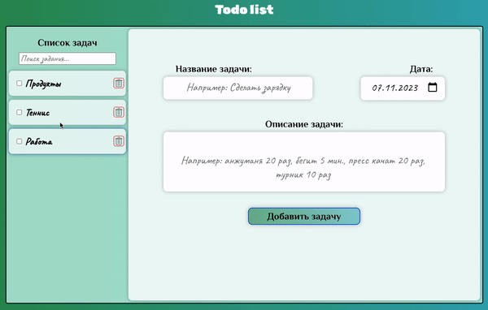

<h1 align="center"> 
  <a href="https://gusap9.github.io/todo/" target="_blank"> React Todo App </a>
  <a href="https://gusap9.github.io/todo/">  </img></a>
</h1>

## About 
The classic task scheduling application.

## Peculiarities
Important points of my app:
- tasks can be changed/delete/completed. &#8595;&#8595;&#8595;

 </img>
- search also works when tasks change. &#8595;&#8595;&#8595;

 </img>
- the list of tasks is automatically sorted by date. &#8595;&#8595;&#8595;

 </img>

## Usage
To see the project you can directly visit:

<a href="https://gusap9.github.io/todo/" target="_blank"><code style="margin-left:40px">https://gusap9.github.io/todo/</code></a>

To use the app localy:
- clone the todo repo.
- install the dependencies.
- run `npm run start`.
